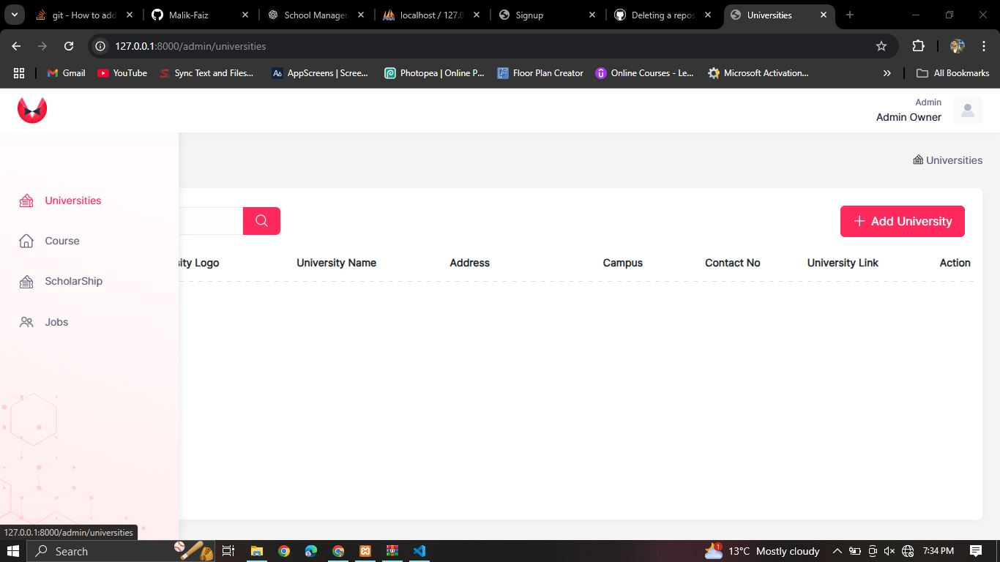
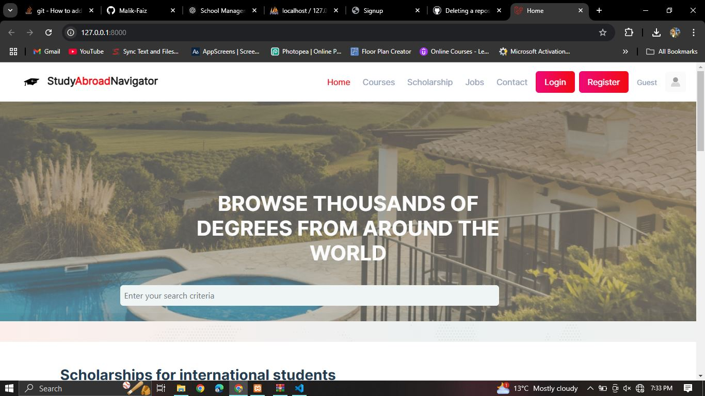
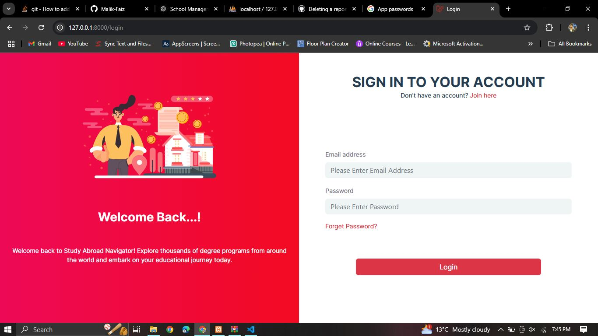

# EduNavigator

EduNavigator is a Laravel-based portal that provides information on **offered courses**, **available scholarships**, and **job opportunities**.

---

## Modules

### 1. **Courses**
- Browse and search for courses.
- View detailed descriptions, eligibility requirements, and enrollment links.

### 2. **Scholarships**
- Explore available scholarships.
- Filter by eligibility criteria, location, and field of study.
- Access application details.

### 3. **Jobs**
- Discover job opportunities tailored for students and professionals.
- View job descriptions, qualifications, and application processes.

<<<<<<< HEAD
### 4. **Home Page**
=======
### 4. **Admin Dashboard**
- The admin dashboard for managing courses, scholarships, and job opportunities.
- **Screenshot**:  
  

### 5. **Home Page**
>>>>>>> 78ee157783a78cb4bcba4213a2e4af98519dbe31
- The homepage of EduNavigator, featuring the main navigation and user-friendly layout.
- **Screenshot**:  
  

<<<<<<< HEAD
### 5. **User Registration and Login**
- Secure registration and login for personalized access.
- **Screenshot**:  
  

### 6. **Admin Dashboard**
- The admin dashboard for managing courses, scholarships, and job opportunities.
- **Screenshot**:  
  
=======
### 6. **User Registration and Login**
- Secure registration and login for personalized access.
- **Screenshot**:  
  
>>>>>>> 78ee157783a78cb4bcba4213a2e4af98519dbe31

---

## Note

If you encounter errors during registration, update the `.env` file with your mail configuration:

```env
MAIL_DRIVER=smtp
MAIL_HOST=smtp.gmail.com
MAIL_PORT=465
MAIL_USERNAME=youremail@gmail.com
MAIL_PASSWORD=yourPassword
MAIL_ENCRYPTION=ssl
MAIL_FROM_NAME="${APP_NAME}"
